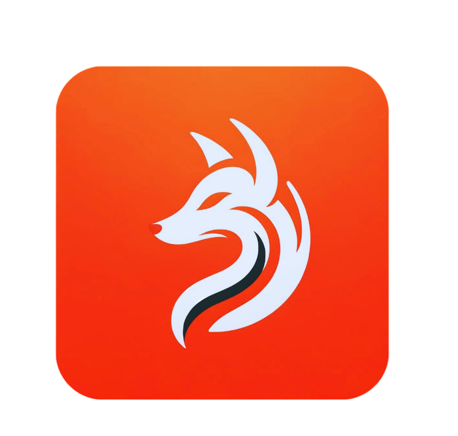

    

<h1>Rift</h1>

 

 
 

# Building

This is still in development, so the build process is not yet available.

# Contributing

This is still in development, so the contribution process is not yet available.
Although any comments or suggestions are MORE than welcome =)

# License

The Rift Langauge is provided under SPDX-License-Identifier: GPL-2.0. 
See `LICENSE` for more information.

# Roadmap

- Lexer ✅
- Parser (recursive maybe change to ANTLR later)
- Full AST
- JIT
- Symbol Table
- Exception Handling
- Custom IR
- Optimization passes
- {VSCode, NeoVim} Tooling
- Standard Kits (std/stk)
- Documentation (middle way)
- Benchmarks
- Lot Lot More....
- Bake it into BoneOS as a config mechanism
    - kind of like Nix (very ambitious)

